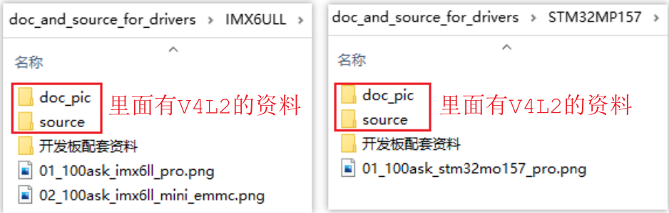
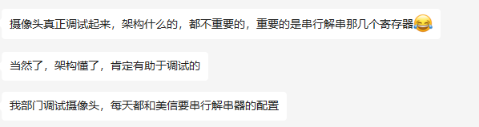
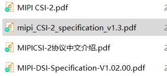

# V4L2视频介绍及资料下载 #

## 1. 资料下载

GIT仓库：

```shell
https://e.coding.net/weidongshan/projects/doc_and_source_for_projects.git
```

注意：上述链接无法用浏览器打开，必须使用GIT命令来克隆。

GIT简明教程：http://download.100ask.org/tools/Software/git/how_to_use_git.html

下载到GIT仓库后，V4L2资料在里面：




## 2. 收到的建议

subdev, media control, media framework, vb2 buffer的分配，怎么轮转，怎么跟硬件打交道，然后图像给应用层用

有的摄像头有控制接口iic,spi，还有没有控制接口的，我们怎么处理？

串行和解串包括cphy和dphy




现在sensor一般都是mipi输出（iic做控制），丢到ISP，ISP处理完了就拿到一帧数据，后面还可能有裁剪和编码等。@韦东山 会有ISP部分讲解吗？最终视频输出是屏幕还是通过网络做IPC或者USB做UVC?

MIPI资料网上也挺多的啊，把协议啃一啃

https://www.mipi.org/



现在汽车上面都是sensor通过串行/解串器，然后通过mipi接口连接到soc

sensor---串行器---GSML---->解串器---->soc（mipi接口）这一条路也涉及一下，自动驾驶基本都涉及这个


## 3. 学习笔记

好文：https://zhuanlan.zhihu.com/p/613018868

Linux V4L2子系统分析（一）: https://blog.csdn.net/u011037593/article/details/115415136

Linux V3H 平台开发系列讲解（摄像头）2.1 MAX9296 GMSL链路配置: https://blog.csdn.net/xian18809311584/article/details/131182605


https://github.com/GStreamer/gstreamer


麦兜<chenchengwudi@sina.com> 14:55:33
我也正在看V4L2，也参考了上面提到的Linux设备驱动开发，还有内核文档，基于5.4内核的，大家可以参考下

麦兜<chenchengwudi@sina.com> 14:55:42
https://lvxfuhal9l.feishu.cn/docx/Cyssdr8BVonDnnx3YjUc4O9xngg

麦兜<chenchengwudi@sina.com> 14:55:49
https://lvxfuhal9l.feishu.cn/docx/MYYndrVvPolMA4xhBCNczE4WnWf

麦兜<chenchengwudi@sina.com> 14:56:32
准备写一组笔记，目前完成了1.5篇


颜色空间总结 https://blog.51cto.com/u_15471597/4927811

https://zhuanlan.zhihu.com/p/159148034


sRGB和RGB的转换

https://www.zhangxinxu.com/wordpress/2017/12/linear-rgb-srgb-js-convert/


YUV(有程序)

https://www.cnblogs.com/a4234613/p/15497724.html

浅谈YUV444、YUV422、YUV420

http://www.pjtime.com/2021/4/192828404475.shtml

YUV与RGB 以及之间的转换

https://blog.csdn.net/WANGYONGZIXUE/article/details/127971015

YUV 4:4:4  每一个Y对应一组UV

​    YUV 4:2:2 每两个Y共用一组UV

​    YUV 4:2:0 每四个Y共用一组UV


480i、576i是什么意思？

SDTV、EDTV、HDTV：

* SDTV：
  * 采样频率13.5MHz，
  * 每行扫描线包含858个采样点（480i系统）或864个采样点（576i系统）
  * 有效线周期内，都是720个采样点
  * 后来支持16:9宽高比，采样率为18MHz（有效分辨率为960x480i和960x576i），有效线内960个采样点
* EDTV
  * 480p、576p
  * 采样频率：4:3宽高比27MHz，16:9宽高比36MHz
* HDTV
  * 720p、1080i、1080p
  * 每线的有效采样点数量、每帧的有效线数目：都是恒定的，无论帧率如何
  * 每种帧率都使用不同的采样时钟频率

* 480i和480p系统
  * 480i属于SDTV
  * 480p属于EDTV
  * 隔行模拟分量视频
    * 每帧525线，有效扫描线为480，在23~262和286~525线上显示有效视频
    * 帧率：29.97Hz（30/1.001）
  * 隔行数字分量视频
    * 
  * 逐行模拟分量视频
    * 帧率：59.94Hz（60/1.001）
    * 每帧525线，有效扫描线为480，在45~524线上显示有效视频
* 576i和576p系统
  * 隔行模拟复合视频：单一信号线，每帧625线
  * 隔行模拟分量视频：三种信号线，帧率25Hz，每帧625线，在23~310和336~623线上显示有效视频
  * 逐行模拟分量视频：三种信号，帧率50Hz，每帧625线，在45`620线上显示有效视频
  * 隔行数字分量视频
  * 逐行数字分量视频

SDTV、EDTV、HDTV是数字电视的三种标准，分别是标清电视、增强型标清电视和高清电视。它们的区别在于分辨率、画质和声音的质量。

1. SDTV（Standard Definition Television）：标清电视，分辨率为720×576或720×480，采用4:3的屏幕比例，通常是普通的电视机或DVD播放机所使用的基本分辨率。在播放高清节目时，会有黑边或画面拉伸等显示不完整的情况。
2. EDTV（Enhanced Definition Television）：增强型标清电视，分辨率为1280×720或960×540，采用16:9的屏幕比例。比标清电视分辨率更高，但仍不达到高清的标准，适用于播放分辨率较高的电影或游戏。在播放高清节目时，会有黑边或画面拉伸等显示不完整的情况。
3. HDTV（High Definition Television）：高清电视，分辨率为1920×1080或1280×720，采用16:9的屏幕比例，画面质量高，声音也更为清晰。是当前数字电视的最高标准，适用于播放高清电影、游戏、体育赛事和其他节目。在播放标清节目时，电视会对其进行升频，会用比标清分辨率更高的分辨率去显示，从而提高画质体验。


YUV420P(YU12和YV12)格式 https://blog.csdn.net/lz0499/article/details/101029783


色彩校正中的 gamma 值是什么

https://www.jianshu.com/p/52fc2192ae7b

https://www.zhihu.com/question/27467127


https://blog.csdn.net/weixin_42203498/article/details/126753239

https://blog.csdn.net/m0_61737429/article/details/129782000

https://blog.csdn.net/seiyaaa/article/details/120199720

Linux多媒体子系统01：从用户空间使用V4L2子系统 https://blog.csdn.net/chenchengwudi/article/details/129176862

Video Demystified：

https://www.zhihu.com/column/videodemystified


摄像头：

https://mp.weixin.qq.com/s?__biz=MzUxMjEyNDgyNw==&mid=2247510675&idx=1&sn=66fcc83a95974add9d25a6e9b925c43b&chksm=f96bd867ce1c5171976838ddf995fc6f68e7e839c797bfa6f690c94b577d359939ad1a816cd1&cur_album_id=2583789151490113538&scene=189#wechat_redirect


UI 设计知识库 [01] 色彩 · 理论 https://www.jianshu.com/p/34e9660f00f4

UI 设计知识库 [02] 色彩 · 理论 – 常见问题 https://www.jianshu.com/p/7f652ae75142

UI 设计知识库 [03] 色彩 · 配色 https://www.jianshu.com/p/b56acefc66ed


sRGB https://en.wikipedia.org/wiki/SRGB https://zh.wikipedia.org/wiki/SRGB%E8%89%B2%E5%BD%A9%E7%A9%BA%E9%97%B4

色彩空间是什么？ https://www.pantonecn.com/articles/technical/what-are-your-color-spaces


Gamma、Linear、sRGB 和Unity Color Space，你真懂了吗？ https://zhuanlan.zhihu.com/p/66558476

https://baike.baidu.com/tashuo/browse/content?id=9167c87c2cd4f1c2f4d1c173&lemmaId=2147136&fromLemmaModule=pcRight


A Standard Default Color Space for the Internet - sRGB https://www.w3.org/Graphics/Color/sRGB


术语：

colorspace： SMPTE-170M、 REC-709 (CEA-861 timings) 、 sRGB (VESA DMT timings)

NTSC TV 、PAL

HDMI EDID

progressive、interlaced、

HDMI、webcam TV、S-Video

S-Video and TV inputs

Y'CbCr、RGB、

YUYV 4:4:4, 4:2:2 and 4:2:0

V4L2 capture overlay


